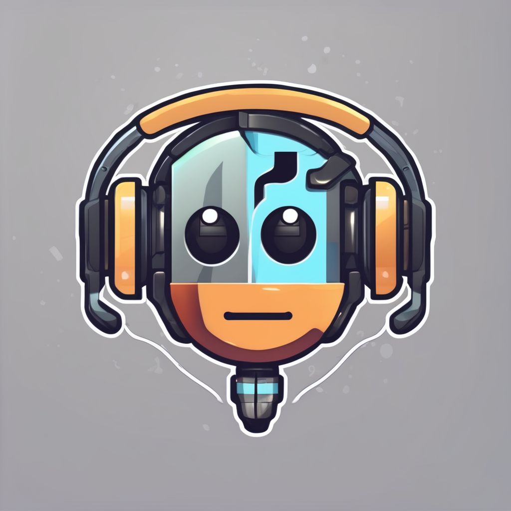

<a id="readme-top"></a>

<!-- PROJECT LOGO -->
<br />
<div align="center">
  
  <h3 align="center">Simple Discord Music Bot</h3>
</div>

<!-- TABLE OF CONTENTS -->
<details>
  <summary>Table of Contents</summary>
  <ol>
    <li>
      <a href="#about-the-project">About The Project</a>
      <ul>
        <li><a href="#built-with">Built With</a></li>
      </ul>
    </li>
    <li>
      <a href="#getting-started">Getting Started</a>
      <ul>
        <li><a href="#installation">Installation</a></li>
      </ul>
    </li>
    <li><a href="#acknowledgments">Acknowledgments</a></li>
  </ol>
</details>

## About The Project

This Discord music bot is designed to provide a simple and straightforward way to play music in your Discord server. It includes a set of basic commands to help you queue, play, and control the music playback.

### Key Features

1. **Clean**: Clean all the bot messages.
2. **Invite**: Invite the bot to your server.
3. **Ping**: Use this command for testing the bot's response.
4. **8D**: Toggle the 8D vocal filter.
5. **Back**: Play the previous track.
6. **Clear**: Remove all tracks from the queue (without stopping the current track).
7. **Jump**: Jump to a track at a specific position in the queue.
8. **List**: List all track information in the queue.
9. **Lyrics**: Get lyrics for the current song.
10. **Pause**: Pause the current playing song.
11. **Play**: Play and enqueue a track from a given URL or search keyword.
12. **Remove**: Remove a track from a given position in the queue.
13. **Replay**: Replay the current track.
14. **Resume**: Resume the paused song.
15. **Seek**: Seek the player to a specific timestamp.
16. **Shuffle**: Toggle shuffle mode for the queue.
17. **Skip**: Skip the current playing song.
18. **Skipto**: Skip to a specific position in the queue.
19. **Stop**: Stop the player.
20. **Vocalboost**: Toggle the vocal boost filter.

<p align="right">(<a href="#readme-top">back to top</a>)</p>

### Built With

- [Node.js](https://nodejs.org/en) - A JavaScript runtime environment for server-side development.
- [TypeScript](https://www.typescriptlang.org/) - A statically typed superset of JavaScript that compiles to plain JavaScript.
- [Discord.js v14.15.3](https://discord.js.org/docs/packages/discord.js/14.15.3) - A powerful JavaScript library for interacting with the Discord API.
- [Discord Player js](https://discord-player.js.org/) - A robust framework for developing Discord Music bots using JavaScript and TypeScript.

<p align="right">(<a href="#readme-top">back to top</a>)</p>

<!-- GETTING STARTED -->

## Getting Started

### Installation

1. Clone the repo
   ```sh
   git clone https://github.com/someoneudonknow/discord-music-bot.git
   ```
2. Install NPM packages
   ```sh
   npm install
   ```
3. Config the bot

   - Create a discord bot and get the required info
   - create and .env file and add these variables

   ```sh
    NODE_ENV=<dev-OR-prod>

    DISCORD_TOKEN_DEV=<YOUR-BOT-TOKEN-IN-DEV-MODE>
    DISCORD_CLIENT_ID_DEV=<YOUR-CLIENT-ID-IN-DEV-MODE>
    DISCORD_APP_ID_DEV=<YOUR-APP-ID-IN-DEV-MODE>

    DISCORD_TOKEN_PROD=<YOUR-BOT-TOKEN-IN-PRODUTION-MODE>
    DISCORD_CLIENT_ID_PROD=<YOUR-CLIENT-ID-IN-PRODUTION-MODE>
    DISCORD_APP_ID_PROD=<YOUR-CLIENT-ID-IN-PRODUTION-MODE>
   ```

4. Run and build the bot
   ```sh
   npm run dev #for run
   npm run build #for build
   ```

<p align="right">(<a href="#readme-top">back to top</a>)</p>

## Acknowledgments

- [Discordjs guide](https://discordjs.guide/)
- [Discordjs v14.15.3 docs](https://discord.js.org/docs/packages/discord.js/14.15.3)
- [Discord player js](https://discord-player.js.org/)
- [Typescript handbook](https://www.typescriptlang.org/docs/handbook/intro.html)

<p align="right">(<a href="#readme-top">back to top</a>)</p>
